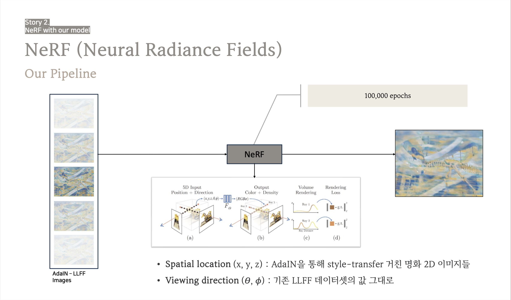
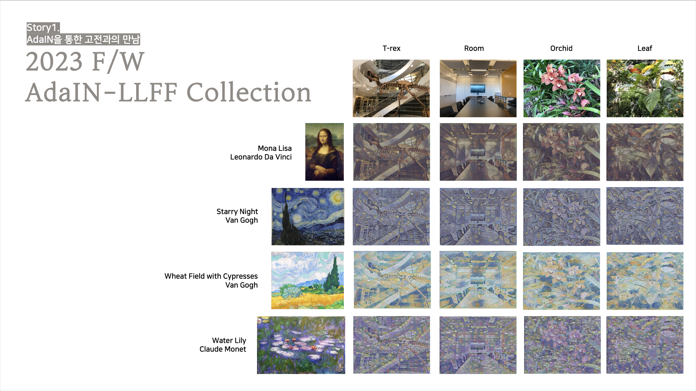

# NeRF-Pytorch

- This implementation is slightly changed implementation of NeRF, originally implemented by yenchenlin
- [Author's implementation of NeRF](https://github.com/yenchenlin/nerf-pytorch)
- Model Structure
  - Original NeRF

  - Our model's Structure
    
  - Input Images
    
  - Output
    
  - Visualization of Train steps

